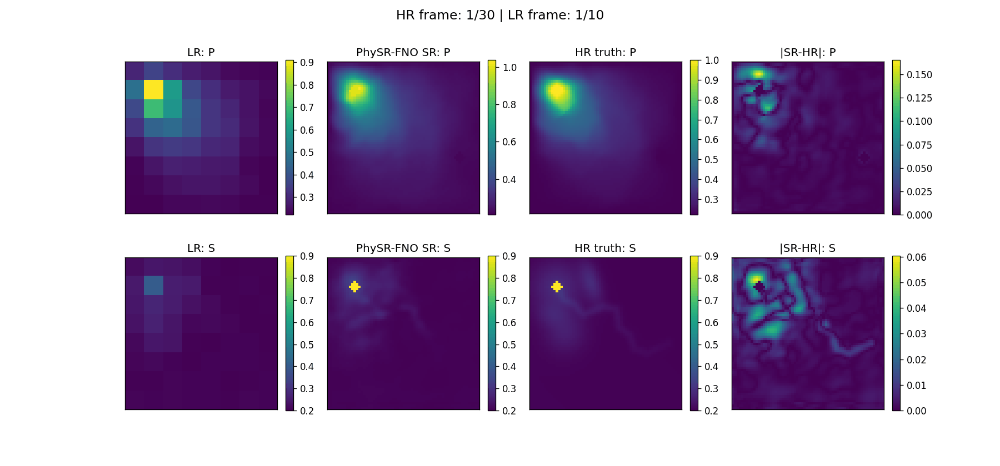

# PhySR-FNO: физически-информированное сверхразрешение для моделирования двухфазной фильтрации

> Быстрое восстановление высокоразрешённых полей давления и водонасыщенности в неоднородных нефтяных пластах с помощью физически-информированного суперразрешения и нейронного оператора фурье.

## О проекте

Этот репозиторий содержит реализацию **PhySR-FNO** — модели физически-информированного сверхразрешения для ускорения моделирования двухфазной фильтрации вода–нефть в неоднородной пористой среде.

Классические конечно-объёмные методы надёжны для задач моделирования пластов, но высокоразрешённые расчёты требуют много вычислительных ресурсов. В то же время стандартные PINN-подходы плохо справляются с резкими фронтами насыщенности, которые возникают в задачах типа Бакли — Леверетта.

Проект был разработан в рамках бакалаврской выпускной квалификационной работы, посвящённой сравнению численных методов, PINN-подходов и физически-информированного сверхразрешения для задачи двухфазной фильтрации.

Главная сложность задачи — наличие резких движущихся фронтов насыщенности. Такие фронты плохо аппроксимируются стандартными нейросетевыми методами, потому что решение является транспортно-доминированным и негладким.

## Метод

Общий пайплайн проекта:

1. Генерация высокоразрешённых эталонных траекторий с помощью конечно-объёмного солвера.
2. Пространственное и временное понижение разрешения для получения low-resolution входов.
3. Интерполяция low-resolution данных до целевой сетки.
4. Предсказание residual-поправки с помощью PhySR-FNO.
5. Жёсткое наложение физических ограничений и граничных условий.
6. Оценка качества реконструкции, сохранения фронта насыщенности, физической допустимости и скорости инференса.

Модель предсказывает не всё поле напрямую, а поправку к интерполированному baseline:

```text
u_hat_HR = u_interp + [delta_P, delta_S]
````

где:

* `u_interp` — интерполированное низкоразрешённое поле;
* `delta_P` — поправка к давлению;
* `delta_S` — поправка к водонасыщенности.

## Архитектура

PhySR-FNO использует отдельные энкодеры для динамических и статических признаков.

Динамический вход:

```text
[P_LR, S_LR]
```

Статический вход:

```text
[K, H, m, injector_mask, producer_mask, coordinates]
```


.png)
Основная модель, **PhySR-FNO**, объединяет:

- residual super-resolution;
- Fourier Neural Operator блоки;
- кодирование статических свойств пласта;
- жёсткое наложение граничных условий;
- физически-информированную функцию потерь;
- дополнительные loss-компоненты для сохранения фронта насыщенности.

После интерполяции входные поля проходят через сверточные энкодеры, объединяются со статическими признаками пласта и затем обрабатываются FNO-блоками. На выходе модель предсказывает residual-поправки для давления и насыщенности.

Ключевая часть модели — блоки Fourier Neural Operator (FNO). В отличие от обычных сверточных слоев, которые видят только локальную область вокруг каждой ячейки, FNO обрабатывает поле в частотной области. Для этого признаки переводятся с помощью FFT в пространство Фурье, где модель обучает спектральные веса для выбранных частотных мод. После этого результат возвращается обратно в физическое пространство через обратное преобразование Фурье.

Пример работы модели 


## Основные результаты

### Synthetic ×8 benchmark

| Модель    | Ошибка давления ↓ | Ошибка насыщенности ↓ | Balanced error ↓ | Front IoU ↑ | Ускорение относительно FV ↑ |
| --------- | ----------------: | --------------------: | ---------------: | ----------: | --------------------------: |
| PhySR-FNO |            2.435% |                6.032% |           4.233% |      0.9564 |                       1105× |
| PhySR     |            6.301% |               13.648% |           9.974% |      0.8858 |                        951× |
| PiRD      |           20.823% |               26.027% |          23.425% |      0.6907 |                        171× |
| DB-AFNO   |           11.124% |               25.663% |          18.393% |      0.6742 |                        724× |

На наиболее сложном synthetic ×8 benchmark модель PhySR-FNO показывает наименьшую ошибку восстановления и лучше всего сохраняет геометрию фронта насыщенности.

### Влияние коэффициента увеличения разрешения

| Масштаб | Ошибка давления ↓ | Ошибка насыщенности ↓ | Front IoU ↑ | Нарушения границ насыщенности ↓ |
| ------- | ----------------: | --------------------: | ----------: | ------------------------------: |
| ×2      |            0.610% |                1.692% |      0.9887 |                               0 |
| ×4      |            1.129% |                2.945% |      0.9802 |                               0 |
| ×8      |            2.435% |                6.032% |      0.9564 |                               0 |

Качество ожидаемо снижается при переходе к более грубому входу, однако модель сохраняет физически допустимые значения насыщенности и стабильно улучшает результат по сравнению с прямой интерполяцией.

### SPE10-based reservoirs

| Датасет  | Ошибка давления ↓ | Ошибка насыщенности ↓ | Balanced error ↓ | Front IoU ↑ | Ускорение относительно FV ↑ |
| -------- | ----------------: | --------------------: | ---------------: | ----------: | --------------------------: |
| SPE10 ×8 |            4.282% |                6.928% |           5.605% |      0.9232 |                        626× |

Эксперимент на SPE10 показывает, что модель работает не только на синтетических структурах, но и на более реалистичных неоднородных полях проницаемости.

## Установка

Проект тестировался на Linux с Python 3.10+.

```bash
python3 -m venv .venv
source .venv/bin/activate

python3 -m pip install --upgrade pip
python3 -m pip install -r requirements.txt
python3 -m pip install .
```

На Ubuntu лучше использовать `python3`, так как команда `python` может быть недоступна по умолчанию.

## Быстрый запуск

```bash
python3 scripts/evaluate_all.py  --device gpu
```

Ожидаемые выходные файлы:

```text
results/RUN_REPORT.md
results/smoke_metrics_after_install.json
```

Запуск на GPU:

```bash
python3 scripts/evaluate_all.py --mini --device cuda
```

